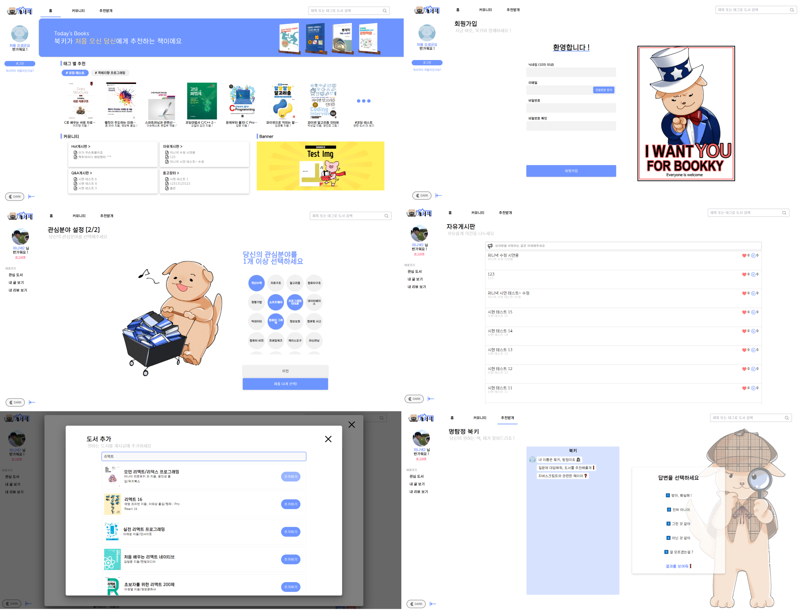
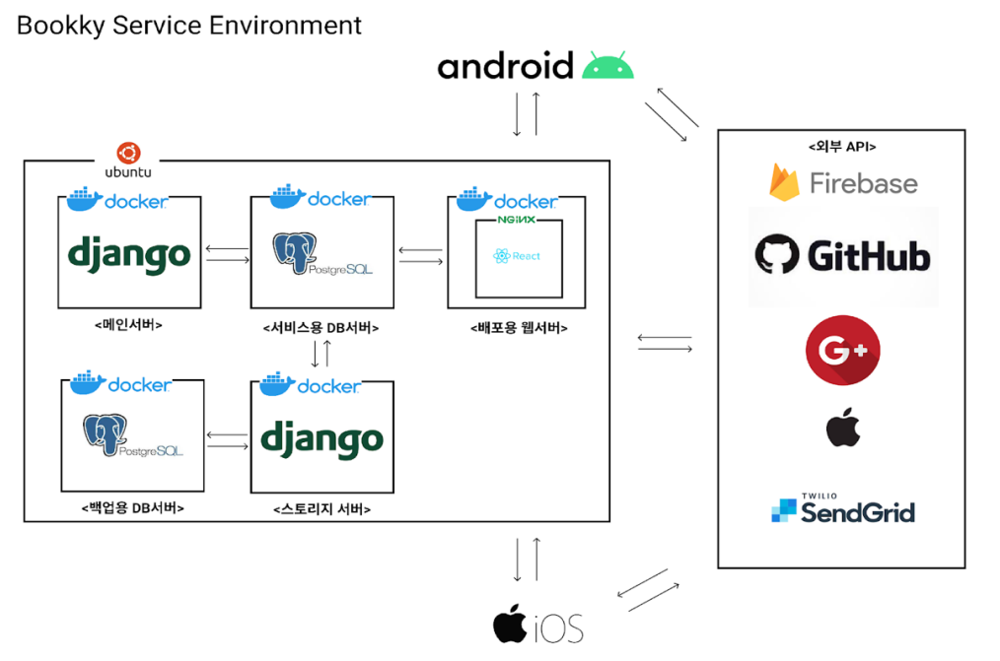
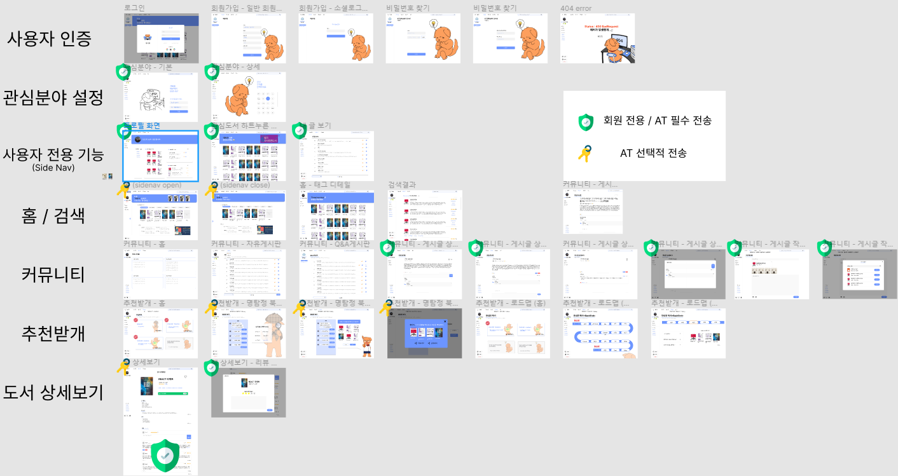

# Bookky Web by Team. Corner

- Language : JavaScript
- FrameWork/Library List
  - Create-React-App
  - React
  - react-redux
  - redux-devtools-extension
  - react-router-dom
  - styled-components
  - Tailwind CSS
  - @mui/material
  - react-horizontal-scrolling-menu

### 📌 프로젝트 개요

- 개발자를 위한 맞춤형 도서 추천 및 커뮤니티 서비스를 제공.
- 사전 설문을 통해, 사용자의 개발 관심 분야와 난이도를 고려하여 가장 적합한 도서를 추천.
- 개발자 간 지식 및 도서 공유 커뮤니티 기능을 제공.

### 📌 프로젝트 기간 및 참여인원

- 프로젝트 기간 : 2022.03. ~ 2022.06.
- 참여 인원 : 5명 (FE 1명, BE/Android 2명, iOS 2명 中 FE에 참여)

### 📌 사용 기술 및 개발 환경

| 주요 환경      | Windows 10, Visual Studio Code                                               |
| -------------- | ---------------------------------------------------------------------------- |
| 사용 기술      | React, Styled-Components, React-Redux,Linux, Docker, Nginx, Djanggo, Swagger |
| 언어           | HTML5, CSS, JavaScript                                                       |
| 기타 협업 도구 | GitHub, Figma, Notion                                                        |

### 📌 담당했던 업무

- UI 설계 디자인 전체
- 웹 프론트엔드 전체 1인 개발

### 📌 **주요 기능 및 구현 과정**

- **UI/UX 설계**

  - Figma 활용
  - 

- **회원관리**

  - 회원가입 / 로그인 / 사용자 인증
  - JWT 토큰 인증방식으로 기존 세션 방식 대비 강화된 보안으로 사용자를 인증
  - 사용자 편의를 고려해, MUI 라이브러리의 모달을 활용해 별도의 페이지 이동없이도 로그인할 수 있도록 설계/구현.
  - SMTP 서버를 활용한 이메일 인증.

- **사용자 기호에 맞춘 도서 추천**

  - 회원가입 시 사용자 관심분야 설정
  - 최초 로그인 시, 관심분야 설정 페이지로 이동.
    1. 개발 경험에 관해 묻는데, 이때 선택한 답변에 따라 다음 질문의 태그 선택지의 범위가 달라짐.
       - 개발 경험이 없다면, 비교적 기초적인 기술태그(C, Python, HTML 등)만 보여짐.
       - 개발 경험이 있다면, 상세한 기술 태그(프레임워크, 라이브러리 등)들이 추가로 보여짐.
    2. 선택한 태그에 맞춰 메인화면에서 각 태그에 해당하는 도서를 추천.

- **게시판 (커뮤니티)**

  - 카테고리별 게시판 / 게시글 작성, 수정, 삭제 / 게시글 내 도서 임베드 / 질문 게시판의 답글 기능 / 댓글·대댓글 / 좋아요(공감) 기능
  - 도서 커뮤니티라는 서비스 특성에 맞게, 게시글에 도서를 첨부할 수 있도록 구현.
  - 게시글에 임베드된 도서 배너를 클릭하면 해당 도서에 대한 정보 화면으로 이동
  - 게시글 작성 시, 모달 창을 통해 도서 임베드를 추가.
  - 질문 게시판에서는 포털사이트의 답변 글과 비슷한 형태로 구성하고자, 게시글에 pid라는 속성을 두어, 상-하위 관계를 지정.
  - 상위 게시글 API 호출 시, 하위 게시글도 배열 형태로 함께 불러오도록 설계/구현
  - 댓글도 마찬가지로, 댓글-대댓글을 상-하위 관계를 지정.
  - ‘게시글-답글’과 ‘댓글-대댓글’ 기능 구현 시, response의 형태를 계속 바꾸어가며 맞춰가야 했기에, **서버 개발자와 지속적으로 소통하며 해결.**

- **사용자 프로필**
  - 프로필 수정 / 관심 분야 모아보기 / 내 게시글 모아보기 / 관심도서 모아보기 / 내 리뷰 모아보기

### 📌 성과 및 배운 점

- 일러스트 **디자이너 지인**을 통해 페이지 구성에 필요한 이미지나 그림을 직접 요청하며 **협업**할 수 있었다는 점에 흥미를 느낌.
- 다양한 React 관련 라이브러리 활용 방법 습득.
  - 기존 프로젝트에서 겪었던 props drilling 문제를, 전역 상태관리 라이브러리인 **react-redux**를 도입하면서 완화.
- 유지보수 편의성을 고려하여, **프로젝트 폴더구조를 도메인별로 나누어 구성**
- **재사용 가능한 부분은 최대한 컴포넌트화.**

### 📌 참고 링크

- **프로젝트 GitHub Repository (Web FE)**
  - https://github.com/GNU-CORNER/BookkyProject_Web
